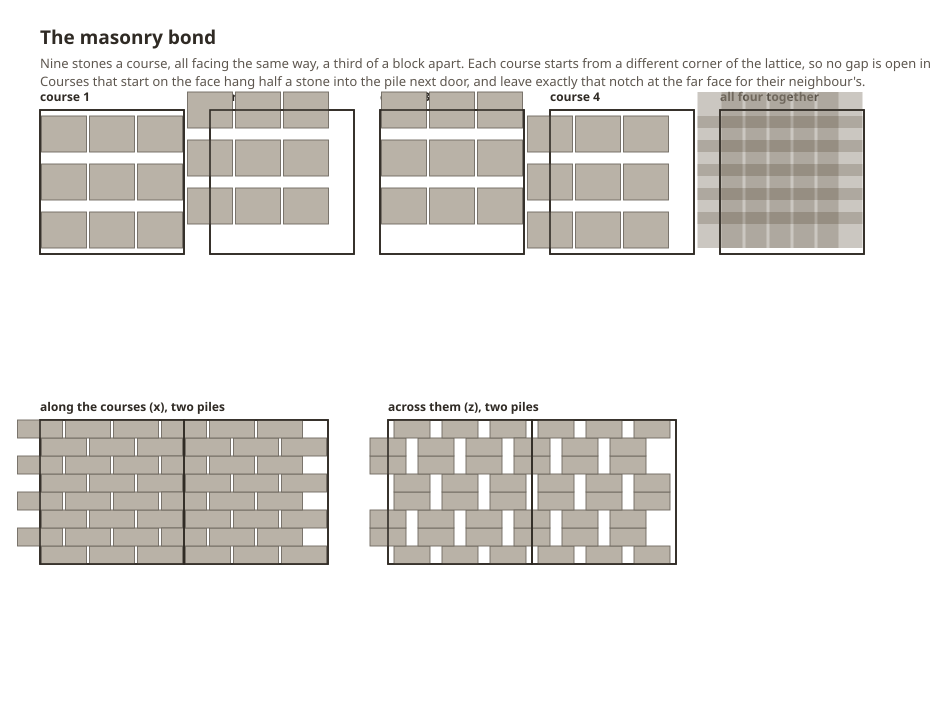

# Acervus Lapidum


Drop a stone on the ground in Vintage Story and you get a pile. Drop a second one and you get…
the same pile. Nothing changes until the third.

That is not a bug — vanilla's stone pile draws a fixed 32-rock model scaled to a 64-stone stack, so
two stones share one visible rock. It also means a half-empty pile looks full, a pile can never be
tidied, and nothing can ever go on top of one.

Acervus Lapidum ("heap of stones") makes the pile tell the truth. **One stone in your hand is one
stone in the pile is one rock you can see.** Then it lets you do something with them.

## What you get

- **Honest piles.** Every stone you put down is rendered. Take one back and one rock disappears.
  Mixed rock types show as what they are — a granite in a pile of basalt looks like a granite.
- **Cairns.** Fill a pile and it will carry another on top. Keep going and the column narrows into
  a proper waymarker, course by course, the way you would actually build one.
- **Low walls.** A wall layout lays the same stones in two staggered courses. Put a few in a row
  and they line up into continuous drystone rather than a row of separate heaps.
- **A solid block, if you want one.** Fill a pile in the masonry layout and you get real coursed
  stone: walkable, buildable, fences and torches take hold. It costs what it looks like it costs.
- **Eleven layouts**, switched with **F** while looking at a pile — with a stone in hand or
  without one, the same picker either way. It groups them into rows by what kind of pile you are
  after (loose stone, waymarks, masonry, ornament), and its last row turns the pile, 45° a click.
- **Mix your rock however you like.** A granite dropped into a basalt pile stores as granite,
  renders as granite and comes back as granite. Nothing insists a pile be all one stone.
- **Your old piles are left exactly as they are.** Vanilla stone piles keep rendering and keep
  handing stones back with this mod installed — nothing is rewritten behind your back. Convert
  them when *you* want to, with `/rockpile convert`, and turn them back with `/rockpile revert`.
- **Other mods' rocks pile too.** Anything whose item code starts `stone-` is picked up, so the
  rock types from Geology Addons and friends work without a compatibility patch each.
- **Knapping is untouched.** Piling uses Ctrl as well as sneak, so the sneak + right-click that
  starts a knapping surface still belongs to vanilla.

Requires **Vintage Story 1.22.x**.

## How a pile works

**Sneak + Ctrl + right-click** with stones in hand to place or add — hold the button down to keep
feeding the pile a stone at a time. A hold stays in the column it started in, so drifting off a
finished pile will not scatter stones onto the ground beside it; starting a pile somewhere new
takes a fresh click. Plain **right-click** takes one back, **Ctrl + right-click**
takes several. **F** opens the layout picker — with a stone in hand or empty-handed, and the last
entry in it turns the pile 45°.

Ctrl is not there to be awkward. Sneak + right-click on its own is how you lay the first stone for
**knapping**, and vanilla keeps its own stone piles out of the way by asking for Ctrl too
(`ctrlKey: true` on stone's ground-storage properties). An earlier version of this mod claimed
sneak + right-click and made every hard stone unknappable.

A pile only becomes solid on top once it is **full**, so you finish a course before you start the
next. That one rule is the whole cairn mechanic.

You do not have to aim at the course you are actually building. Adding a stone to any **finished**
pile carries the click up its own column: the stone lands in the first course above with room in
it, or starts a new one on top of the last full course. That matters as a cairn gets tall, because
each course is narrower than the one under it — the wide base stays the easiest thing to hit, so
that is what you are allowed to click. The walk only ever passes through courses that are already
full, so it still cannot stack on top of a course with gaps in it.

How many stones "full" means depends on how the pile is laid, because it is measured rather than
decided:

| Layout | Stones | |
| --- | --- | --- |
| Heap, neat course | 32 | vanilla's own loose-pile density |
| Spiral | 32 | |
| Wall | 64 | eight courses of eight — stacks, and bonds to its neighbours |
| Cairn | 40 / 28 / 19 | footing, body, shoulder — see below |
| Steps | 43 | a flight of three bonded treads; fills solid to 72 once loaded |
| Hearth ring | 18 | hollow middle |
| Twin columns | 16 | |
| Arrow | 28 | a waypoint marker; turn it to aim it |
| Balanced stack | 8 | one stone a course |
| **Masonry** | **72** | a whole cube, nine to a jointed course, laid in a running bond |

The cairn narrows as it climbs because a ring of `N` stones laid end to end has exactly one
radius, `N × 0.3125 / 2π`. Choosing the count chooses the width, every ring closes with no gap to
see through, and the taper is simply the counts falling: six to a course on the ground, two at the
top. Each segment spends all eight of a block's two-pixel layers, so the one above lands flush on
it — which is also what lets **walls stack**. Put one wall pile on a full one and the courses run
straight through the join, as high as you care to build.

Restyling a pile into a layout that holds fewer stones simply **drops the extra ones at your feet**.
A balanced stack holds eight and masonry holds seventy-two, so changing your mind about a full pile
routinely leaves stones over; they pop out as items rather than sitting in the pile unrendered,
which would break the one thing this pile promises.

### The masonry bond



Masonry stones are **laid with a joint between them**, never face to face. Two stones that touch
share a face exactly, and a course of them reads as one milled slab with lines scored on it. So a
course takes the most stones that still leave daylight — three an axis, nine in all, where tiling
the cube exactly took twelve — all laid the same way round, a third of a block apart. The stone is
5 x 4 pixels on the floor, so that one pitch leaves a 1/3-pixel joint across a course and a
1 1/3-pixel joint through it.

Every gap has **a stone above and below it**, which is what makes them worth packing: a gap with
daylight at both ends is a hole through a block that claims to be solid. Getting there takes four
courses, not two. A course's mortar is a cross-hatch, and however far you slide a second
cross-hatch over the first, the x lines of one still cross the z lines of the other — so each
course starts from a different corner of the lattice, and wherever one course is open, one of the
other three is stone.

Masonry also **bonds to the pile next door**, without needing to know it is there. A course that
starts on the block face centres its first stone on the boundary, half of it in the neighbour's
block, and leaves exactly that much notch at its far face for the neighbour's own — and a solid
pile is always drawn square, so the tooth always points the same way. A run of masonry courses
straight through the boundary with no seam at any width; a pile on its own shows the teeth
instead, which is what an unfinished wall end looks like anyway.

Walls bond differently, because a wall is two leaves of loose stone rather than a dressed cube: its
alternate courses lay a stone across the joint **only when there is a pile to tie into**, and each
pile lays the stone crossing its own near joint and stops short at its far one, where the pile
ahead reaches back over. Every joint gets exactly one bond stone rather than two fighting for the
same space, and bonding moves stones rather than adding them, so a neighbour arriving or going
never changes how many stones a pile holds.

Every pile keeps **its own** layout and its own facing. Stack whatever you like on whatever you
like — a masonry footing under a cairn, steps against the end of a wall — and restyling the one you
are looking at leaves its neighbours alone. Stacked piles take their layout from the stone that
placed them, so a cairn still comes out a cairn all the way up without any of them reaching across
a block boundary.

**Stairs taller than one block** are built the way real ones are. Stack a pile on a flight of steps
and the flight becomes the solid footing carrying it, so the climb continues instead of restarting
at the bottom of every block. Take the load off again and it goes back to being a flight.

Masonry is the odd one out: it does not turn. A coursed cube coaxed 45° would swing its corners a
fifth of a block into its neighbour, which is not something a block claiming to be solid may do.

## Your existing world, and getting back out

Installing this mod changes nothing that is already on the ground. Vanilla stone piles go on
rendering, go on giving stones back a click at a time, and go on being vanilla stone piles. Only
the stones you place from now on build rock piles.

That is deliberate, and it is about the exit. A rock pile is a block this mod owns: uninstall with
rock piles in the world and the game can no longer resolve `acervuslapidum:rockpile`, so the blocks
go — and the stones inside them go with them. Nothing that was already yours should be put at that
risk by a mod you have only just installed.

Two commands move piles between the two worlds. Both need the `controlserver` privilege, both take
a radius in blocks (32 by default) or `all` for every chunk the server currently has loaded, and
both work on loaded chunks only — chunks nobody is near are on disk and out of reach.

```
/rockpile convert 64
/rockpile revert all
```

**Converting** turns nearby vanilla stone piles into rock piles. A full 64-stone one becomes a
two-segment cairn, because that is what it always was: two courses' worth of stone drawn as one.
If you would rather that happened by itself as chunks load, set `convertVanillaPilesOnLoad` to
`true` in `ModConfig/acervuslapidum.json`.

**Reverting** turns rock piles back into vanilla ones, and is the thing to run before you remove
the mod. A vanilla pile is a single 64-stone stack where ours can be a 72-stone masonry course of
mixed rock, so whatever will not fit is dropped at your feet rather than rounded away. Walk your
builds with `/rockpile revert all`, pick up what falls, and the world is plain vanilla again with
every stone still in it.

## Where the geometry comes from

The heap layout is not hand-authored. It is vanilla's own `item/stone-pile.json`, converted.

Two facts make that exact. The stone item is a single 5x2x4 cube centred on the block with its
rotation origin at the bottom-centre; and every cube in vanilla's pile shape rotates about *its*
own bottom-centre too — which is precisely the pivot the block entity's render chain uses. So the
32 cubes map onto 32 slot poses with no fudging, and the layer heights fall out at 0, 2, 4, 6, 8,
10.3 and 12.4 pixels.

`tools/rockpile_geometry.py` does that conversion and generates the other ten layouts, writing
`mod/assets/acervuslapidum/config/rockpile-layout.json` — and `docs/masonry-bond.svg`, the drawing
above, from the very slots it just wrote, so a diagram of the bond cannot quietly stop matching it. It is seeded, so regenerating on an
unchanged install is a no-op diff — there is a test for that. Five of vanilla's cubes are drawn as
re-proportioned boxes rather than rotated ones, and the tool recovers the rotation those
dimensions imply before folding in the cube's own.

## Building

```bash
make test
```

Two suites: the Python geometry that writes the layout config, and the C# the game runs. Neither
needs a world or a running game.

```bash
make install
```

Builds, zips, and drops the result in your Mods folder. `make deploy` does the same after bumping
the patch version; `make run` launches the game; `make deploy-run` does both.

```bash
make assets
```

Regenerates the layout config from the game's shapes. Only this target reads the install —
everything else builds from the committed config, so a clean checkout works offline.

## Related

Sibling to [Liber Terra](https://github.com/lalmei/liber-terra), whose book piles solve the same
problem for books and whose architecture this borrows wholesale.

If you want crafted, static cairn blocks with lantern mounts and fence connections rather than
ones you build stone by stone, look at
[Wilderlands Waymarkers](https://mods.vintagestory.at/show/mod/19736) — it is doing a different
and complementary thing.
