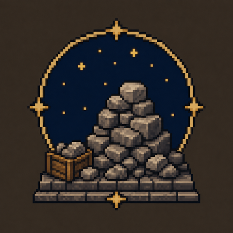

# Acervus Lapidum



Drop a stone on the ground in Vintage Story and you get a pile. Drop a second one and you get…
the same pile. Nothing changes until the third.

That is not a bug — vanilla's stone pile draws a fixed 32-rock model scaled to a 64-stone stack, so
two stones share one visible rock. It also means a half-empty pile looks full, a pile can never be
tidied, and nothing can ever go on top of one.

Acervus Lapidum ("heap of stones") makes the pile tell the truth. **One stone in your hand is one
stone in the pile is one rock you can see.** Then it lets you do something with them.

## What you get

- **Honest piles.** Every stone you put down is rendered. Take one back and one rock disappears.
  Mixed rock types show as what they are — a granite in a pile of basalt looks like a granite.
- **Cairns.** Fill a pile and it will carry another on top. Keep going and the column narrows into
  a proper waymarker, course by course, the way you would actually build one.
- **Low walls.** A wall layout lays the same stones in two staggered courses. Put a few in a row
  and they line up into continuous drystone rather than a row of separate heaps.
- **A solid block, if you want one.** Fill a pile in the masonry layout and you get real coursed
  stone: walkable, buildable, fences and torches take hold. It costs what it looks like it costs.
- **Eleven layouts**, switched with **F** while looking at a pile, or from the tool-mode picker
  with a stone in hand — which also turns the pile, 45° a click.
- **Mix your rock however you like.** A granite dropped into a basalt pile stores as granite,
  renders as granite and comes back as granite. Nothing insists a pile be all one stone.
- **Your old piles still work.** Existing vanilla stone piles convert themselves when their chunk
  loads. A full 64-stone one becomes a two-segment cairn, because that is what it always was.
- **Other mods' rocks pile too.** Anything whose item code starts `stone-` is picked up, so the
  rock types from Geology Addons and friends work without a compatibility patch each.
- **Knapping is untouched.** Piling uses Ctrl as well as sneak, so the sneak + right-click that
  starts a knapping surface still belongs to vanilla.

Requires **Vintage Story 1.22.x**.

## How a pile works

**Sneak + Ctrl + right-click** with stones in hand to place or add — hold the button down to keep
feeding the pile a stone at a time. A hold stays in the column it started in, so drifting off a
finished pile will not scatter stones onto the ground beside it; starting a pile somewhere new
takes a fresh click. Plain **right-click** takes one back, **Ctrl + right-click**
takes several. **F** with empty hands cycles the layout.

Ctrl is not there to be awkward. Sneak + right-click on its own is how you lay the first stone for
**knapping**, and vanilla keeps its own stone piles out of the way by asking for Ctrl too
(`ctrlKey: true` on stone's ground-storage properties). An earlier version of this mod claimed
sneak + right-click and made every hard stone unknappable.

A pile only becomes solid on top once it is **full**, so you finish a course before you start the
next. That one rule is the whole cairn mechanic.

How many stones "full" means depends on how the pile is laid, because it is measured rather than
decided:

| Layout | Stones | |
| --- | --- | --- |
| Heap, neat course, scattered | 32 | vanilla's own loose-pile density |
| Spiral | 32 | |
| Wall | 64 | eight courses of eight — stacks, and bonds to its neighbours |
| Cairn | 40 / 28 / 19 | footing, body, shoulder — see below |
| Steps | 60 | a flight; fills solid to 96 once loaded |
| Hearth ring | 18 | hollow middle |
| Twin columns | 16 | |
| Balanced stack | 8 | one stone a course |
| **Masonry** | **96** | a whole cube, twelve to a course |

The cairn narrows as it climbs because a ring of `N` stones laid end to end has exactly one
radius, `N × 0.3125 / 2π`. Choosing the count chooses the width, every ring closes with no gap to
see through, and the taper is simply the counts falling: six to a course on the ground, two at the
top. Each segment spends all eight of a block's two-pixel layers, so the one above lands flush on
it — which is also what lets **walls stack**. Put one wall pile on a full one and the courses run
straight through the join, as high as you care to build.

Restyling a pile into a layout that holds fewer stones simply **drops the extra ones at your feet**.
A balanced stack holds eight and masonry holds ninety-six, so changing your mind about a full pile
routinely leaves stones over; they pop out as items rather than sitting in the pile unrendered,
which would break the one thing this pile promises.

Walls and masonry **bond to the pile next door**. Alternate courses lay a stone across the joint,
the way a through stone ties a real wall together, so a run of them reads as one wall instead of
separate blocks stood in a line. Each pile lays the stone crossing its own near joint and stops
short at its far one, where the pile ahead reaches back over — so every joint gets exactly one
bond stone rather than two fighting for the same space.

Both ends are considered, so a lone wall or a single masonry block is **symmetric**: flush at both
ends, with nothing hanging out into thin air, and it looks the same whichever way you turn it.
Bonding moves stones rather than adding them, so a neighbour arriving or going never changes how
many stones a pile holds.

Every pile keeps **its own** layout and its own facing. Stack whatever you like on whatever you
like — a masonry footing under a cairn, steps against the end of a wall — and restyling the one you
are looking at leaves its neighbours alone. Stacked piles take their layout from the stone that
placed them, so a cairn still comes out a cairn all the way up without any of them reaching across
a block boundary.

**Stairs taller than one block** are built the way real ones are. Stack a pile on a flight of steps
and the flight becomes the solid footing carrying it, so the climb continues instead of restarting
at the bottom of every block. Take the load off again and it goes back to being a flight.

Masonry is the odd one out: it does not turn. A coursed cube coaxed 45° would swing its corners a
fifth of a block into its neighbour, which is not something a block claiming to be solid may do.

## Where the geometry comes from

The heap layout is not hand-authored. It is vanilla's own `item/stone-pile.json`, converted.

Two facts make that exact. The stone item is a single 5x2x4 cube centred on the block with its
rotation origin at the bottom-centre; and every cube in vanilla's pile shape rotates about *its*
own bottom-centre too — which is precisely the pivot the block entity's render chain uses. So the
32 cubes map onto 32 slot poses with no fudging, and the layer heights fall out at 0, 2, 4, 6, 8,
10.3 and 12.4 pixels.

`tools/rockpile_geometry.py` does that conversion and generates the other ten layouts, writing
`mod/assets/acervuslapidum/config/rockpile-layout.json`. It is seeded, so regenerating on an
unchanged install is a no-op diff — there is a test for that. Five of vanilla's cubes are drawn as
re-proportioned boxes rather than rotated ones, and the tool recovers the rotation those
dimensions imply before folding in the cube's own.

## Building

```bash
make test
```

Two suites: the Python geometry that writes the layout config, and the C# the game runs. Neither
needs a world or a running game.

```bash
make install
```

Builds, zips, and drops the result in your Mods folder. `make deploy` does the same after bumping
the patch version; `make run` launches the game; `make deploy-run` does both.

```bash
make assets
```

Regenerates the layout config from the game's shapes. Only this target reads the install —
everything else builds from the committed config, so a clean checkout works offline.

## Related

Sibling to [Liber Terra](https://github.com/lalmei/liber-terra), whose book piles solve the same
problem for books and whose architecture this borrows wholesale.

If you want crafted, static cairn blocks with lantern mounts and fence connections rather than
ones you build stone by stone, look at
[Wilderlands Waymarkers](https://mods.vintagestory.at/show/mod/19736) — it is doing a different
and complementary thing.
